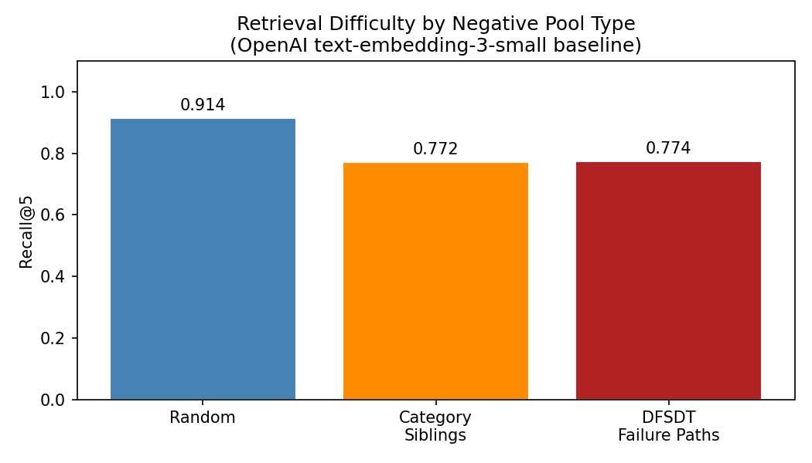

# Multimodal Tool Retrieval via Hard-Negative Contrastive Learning

**Course:** Multimodal AI (MAS.S60 / 6.S985), Spring 2026, MIT

**Team:** Michael Serrano, Arthur De Los Santos, Dylan Mazard

## Abstract

Agentic systems that interact with large API collections face a fundamental retrieval challenge: given a natural language instruction, identify the correct tool from thousands of candidates. We present a contrastive learning framework for API retrieval that leverages hard negatives mined from ToolBench's Depth-First Search Decision Tree (DFSDT) failure traces. Starting from a dense retrieval baseline using OpenAI `text-embedding-3-small` over 4,518 APIs, we train four bi-encoder variants with progressively stronger inductive biases: in-batch negatives, explicit hard negatives from DFSDT traces, a hierarchical contrastive loss incorporating category-level alignment, and a tri-modal objective that jointly aligns queries with API documentation and typed function signatures. Full-corpus retrieval is already near-saturated by the frozen baseline (R@5 = 0.97), but evaluation under structured negatives reveals a large semantic gap: baseline R@5 drops to 0.39 when distractors are drawn from DFSDT failure paths. Our hierarchical variant raises this floor to 0.90 and narrows the random-to-DFSDT R@5 drop from 53% to 10%.

## Motivation

The semantic gap between user instructions (continuous, intent-driven natural language) and API documentation (discrete, schema-defined contracts) makes retrieval non-trivial. Distinguishing semantically similar but functionally different APIs, such as `get_current_weather` vs. `get_weather_forecast`, demands representations that capture functional semantics beyond vocabulary overlap.

## Approach

### Dense Retrieval Baseline (Variant 1)
APIs and queries are embedded with OpenAI `text-embedding-3-small` (1536-d). API embeddings are pre-computed and cached. Retrieval uses a FAISS `IndexFlatIP` (cosine similarity via normalized inner product) over the 4,518-API corpus.

### Hard-Negative Mining via DFSDT Traces
We evaluate three negative-sampling strategies of increasing difficulty:

| Strategy | Source | Difficulty |
|----------|--------|------------|
| **Random** | Uniform sample from corpus | Easy, no structural relationship to query |
| **Category Siblings** | Same ToolBench category as ground-truth API | Medium, shared semantic domain |
| **DFSDT Failure Paths** | APIs from failed or backtracked turns in DFSDT traces | Hard, actively confusable candidates |

### Trained Bi-Encoder Variants
All fine-tuned models use `all-MiniLM-L6-v2` (384-d) with the Multiple Negatives Ranking Loss (InfoNCE):

| Variant | Training Signal |
|---------|-----------------|
| **V2** Bi-encoder + random neg | In-batch negatives only |
| **V3** Bi-encoder + hard neg | DFSDT hard negatives in the loss denominator |
| **V4** Hierarchical loss | Hard negatives + category-level contrastive term (lambda = 0.1) |
| **V5** Tri-modal | Hard negatives + code-signature alignment (lambda_code = 0.5) |

V4 adds a category-level InfoNCE term that pushes queries toward the correct semantic region before fine-grained API matching. V5 represents each API's parameter schema as a typed Python signature and adds query/doc/code three-way contrastive alignment.

## Results

### Full-Corpus Retrieval (4,518 APIs)

| Variant | R@1 | R@5 | R@10 |
|---------|-----|-----|------|
| V1 baseline (`text-embedding-3-small`) | 0.9618 | 0.9726 | 0.9779 |
| V2 bi-encoder + random neg | 0.9730 | 0.9851 | 0.9902 |
| V3 bi-encoder + hard neg | 0.9723 | **0.9862** | 0.9933 |
| V4 hierarchical loss | 0.9723 | 0.9848 | **0.9973** |
| V5 tri-modal | 0.9705 | 0.9824 | 0.9862 |

All fine-tuned variants beat the frozen 1536-d baseline despite using a smaller 384-d backbone.

### Restricted-Pool Evaluation (100 candidates per query)

R@5 across negative conditions:

| Variant | Random | Sibling | DFSDT | Random to DFSDT drop |
|---------|--------|---------|-------|----------------------|
| V1 baseline | 0.8444 | 0.4611 | 0.3944 | 53% |
| V2 random neg | 1.0000 | 0.7222 | 0.6889 | 31% |
| V3 hard neg | 1.0000 | 0.8667 | 0.8000 | 20% |
| V4 hierarchical | 1.0000 | 0.8333 | **0.9000** | **10%** |
| V5 tri-modal | 1.0000 | 0.6889 | 0.6889 | 31% |

The hierarchical loss (V4) achieves the smallest random-to-DFSDT gap, demonstrating that DFSDT failure-path negatives plus category-level regularization yield retrievers robust to structured semantic confusability. All four fine-tuned variants show statistically significant R@5 improvements over the baseline on the DFSDT condition (bootstrap 95% CI, 10,000 resamples).



## Metrics

- **Recall@k** (k = 1, 5, 10), primary retrieval metric
- **Mean Reciprocal Rank (MRR)**
- Bootstrap 95% confidence intervals on per-query score differences

## Repository Structure

```
multimodal-tool-retrieval/
├── README.md                ← this file
├── .gitignore
├── .gitmodules
├── project/                 ← all project code, experiments, and results
│   ├── README.md
│   ├── requirements.txt
│   ├── data/                ← data loading and negative mining
│   ├── models/              ← embedding model (OpenAI API + cache)
│   ├── retrieval/           ← FAISS index and top-k retrieval
│   ├── evaluation/          ← Recall@k, MRR metrics
│   ├── notebooks/           ← experiment notebooks (run in order)
│   ├── results_baseline.json
│   ├── results_hard_negatives.json
│   └── recall_at_5_ablation.png
├── Arthur-MMAI-SP26/        ← Arthur's individual repo (submodule)
├── Dylan-MMAI-SP26/         ← Dylan's individual repo (submodule)
└── Michael-MMAI-SP26/       ← Michael's individual repo (submodule)
```

All project work lives in [`project/`](./project/). Each team member's submodule contains their individual homework assignments.

## Running the Experiments

All experiments run on Google Colab Pro / a single NVIDIA A100. Follow the notebooks in [`project/notebooks/`](./project/notebooks/) in order:

1. **[01_index_apis.ipynb](project/notebooks/01_index_apis.ipynb)**: pre-compute OpenAI embeddings for all API docs.
2. **[02_baseline_eval.ipynb](project/notebooks/02_baseline_eval.ipynb)**: full-corpus baseline retrieval (V1).
3. **[03_hard_negative_eval.ipynb](project/notebooks/03_hard_negative_eval.ipynb)**: restricted-pool ablation across random, sibling, and DFSDT conditions.
4. **[04_analysis.ipynb](project/notebooks/04_analysis.ipynb)**: per-category breakdowns and qualitative analysis.
5. **[05_train.ipynb](project/notebooks/05_train.ipynb)**: train V2 (random) and V3 (hard negatives).
6. **[06_eval.ipynb](project/notebooks/06_eval.ipynb)**: evaluate V2 and V3 on full corpus and restricted pools.
7. **[07_train_hierarchical.ipynb](project/notebooks/07_train_hierarchical.ipynb)**: train V4 with the category-level loss.
8. **[08_train_trimodal.ipynb](project/notebooks/08_train_trimodal.ipynb)**: train V5 with typed code signatures.
9. **[09_final_analysis.ipynb](project/notebooks/09_final_analysis.ipynb)**: bootstrap significance tests, t-SNE visualizations, and final tables.

[`combined_pipeline_with_results.ipynb`](project/notebooks/combined_pipeline_with_results.ipynb) reproduces the full pipeline end-to-end.

### Requirements

```
cd project && pip install -r requirements.txt
```

- OpenAI API key (set as env var `OPENAI_API_KEY` or Colab secret)
- ToolBench dataset (`toolllama_G123_dfs_train.json`, `toolllama_G123_dfs_eval.json`, and `toolenv/tools/`)

## Team Repositories

| Member | Repository |
|--------|-----------|
| Arthur De Los Santos | [MMAI-SP26](https://github.com/arthurdls/MMAI-SP26) |
| Dylan Mazard | [MMAI-Spring2026](https://github.com/Dmazard/MMAI-Spring2026) |
| Michael Serrano | [mmai](https://github.com/michaelyserrano/mmai) |

## References

- Khosla et al. "Supervised Contrastive Learning" (2020)
- Karpukhin et al. "Dense Passage Retrieval for Open-Domain Question Answering" (2020)
- Xiong et al. "Approximate Nearest Neighbor Negative Contrastive Estimation for Dense Text Retrieval" (2021)
- Reimers and Gurevych. "Sentence-BERT: Sentence Embeddings using Siamese BERT-Networks" (2019)
- Radford et al. "Learning Transferable Visual Models From Natural Language Supervision (CLIP)" (2021)
- Feng et al. "CodeBERT: A Pre-Trained Model for Programming and Natural Languages" (2020)
- Qin et al. "ToolLLM: Facilitating Large Language Models to Master 16000+ Real-world APIs" (2024)
- Patil et al. "Gorilla: Large Language Model Connected with Massive APIs" (2024)
- Ramesh et al. "ProTIP: Progressive Tool Retrieval Improves Planning" (2023)
- Du et al. "AnyTool: Self-Reflective, Hierarchical Agents for Large-Scale API Calls" (2024)

## License

<a rel="license" href="http://creativecommons.org/licenses/by-sa/4.0/"></a><br />This work is licensed under a <a rel="license" href="http://creativecommons.org/licenses/by-sa/4.0/">Creative Commons Attribution-ShareAlike 4.0 International License</a>.
