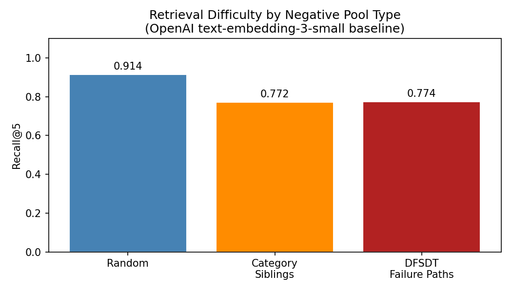

# Project — Multimodal Tool Retrieval via Hard-Negative Mining

**Course:** Multimodal AI (MAS.S60 / 6.S985) · Spring 2026 · MIT
**Team:** Michael Serrano, Arthur De Los Santos, Dylan Mazard

## Overview

This project investigates multimodal retrieval for agentic tool-use: given a natural language instruction, identify the correct API from 16,000+ candidates in the ToolBench corpus. We treat user queries and structured API schemas as distinct modalities and study how the quality of negative examples affects retrieval performance.

## Midterm Results

### Full-Corpus Baseline (Notebook 02)

| Model | R@1 | R@5 | R@10 | MRR |
|-------|-----|-----|------|-----|
| `text-embedding-3-small` | 0.223 | 0.421 | 0.506 | 0.435 |

### Hard-Negative Ablation (Notebook 03)

| Negative Condition | R@1 | R@5 | R@10 | MRR |
|--------------------|-----|-----|------|-----|
| Random | 0.520 | 0.914 | 0.951 | 0.926 |
| Category Siblings | 0.417 | 0.772 | 0.839 | 0.808 |
| DFSDT Failure Paths | 0.414 | 0.774 | 0.851 | 0.810 |

Category-level and DFSDT negatives reduce R@1 by ~10 points vs. random, confirming that the current embedding model cannot distinguish semantically related but functionally different tools.



## Repository Structure

```
project/
├── README.md                ← this file
├── requirements.txt         ← Python dependencies
├── data/                    ← data loading and preprocessing
│   ├── load_toolbench.py    ← load API corpus and eval examples
│   └── negative_mining.py   ← random, sibling, and DFSDT negative sampling
├── models/
│   └── embeddings.py        ← OpenAI embedding API with disk cache
├── retrieval/
│   └── retriever.py         ← FAISS index construction and top-k retrieval
├── evaluation/
│   └── metrics.py           ← Recall@k, MRR, batch evaluation
├── notebooks/
│   ├── 01_index_apis.ipynb  ← embed all APIs (run once)
│   ├── 02_baseline_eval.ipynb  ← full-corpus baseline
│   └── 03_hard_negative_eval.ipynb  ← hard-negative ablation
├── results_baseline.json
├── results_hard_negatives.json
└── recall_at_5_ablation.png
```

## Running the Experiments

All experiments run on Google Colab Pro. Follow notebooks in order:

1. **[01_index_apis.ipynb](notebooks/01_index_apis.ipynb)** — Pre-compute OpenAI embeddings for all API docs. Run once; results are cached.
2. **[02_baseline_eval.ipynb](notebooks/02_baseline_eval.ipynb)** — Full-corpus baseline retrieval (Recall@k, MRR).
3. **[03_hard_negative_eval.ipynb](notebooks/03_hard_negative_eval.ipynb)** — Hard-negative ablation across random, category-sibling, and DFSDT failure-path conditions.

### Requirements

```
pip install -r requirements.txt
```

- OpenAI API key (set as env var `OPENAI_API_KEY` or Colab secret)
- ToolBench dataset (`toolllama_G123_dfs_eval.json` + `toolenv/tools/`)

## Next Steps (Final Report)

1. **Hierarchical Contrastive Loss** — Multi-granularity alignment using ToolBench's API → Tool → Category hierarchy.
2. **Code-Enhanced Tri-Encoder** — BERT + BERT + CodeBERT architecture to disambiguate textually similar but functionally different APIs.
3. **Contrastive fine-tuning** — Bi-encoder with weighted hard negatives (up-weighting DFSDT failure-path negatives).
